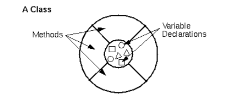

객체란?
```cpp
typedef struct Animal{
    char name[30];
    int age;

    int health;
    int food;
    int clean;


}Animal;
```
기존의 animal 구조체를 정의한 후 animal 변수를 만들어서 이를 필요로 하는 함수들에게
```cpp
play(list[play_with]);
```

이와 같이 전달해 주었다. 이 상황을 그림을 생각하면 마치 Animal이 play 를 진행한다 보단 play를 Animal을 한다라고 볼 수 있다.

따라서 Animal 자체가 play를 하는 것이라고 한다면
```cpp
Animal animal;

animal.play();
animal.sleep();
```

이렇게 작성해 볼 수 있다. 즉 play 함수에 animal을 인자로 주지 않아도 된다.

그래서 객체는 다음과 같이 정의된다.
객체란, 변수들과 참고 자료들로 이루어진 소프트웨어 집합이다.

이 때 객체가 현실 세게에서의존재하는 것들을 나타내기 위해서는 추상화 하는 과정이 필요하다
컴퓨터 상에서 현실 세계를 100% 나타날 수 없는 것이기 때문에 적절하게 컴퓨터에서 처리할 수 있도록 바꾸는 것인다.

예를 들면 핸드폰의 경우 전화를 한다 문자를 보낸다 와 같은 것들은 핸드폰이 하는 것 이므로 함수로 추상화시킬 수 있고 핸드폰의 상태를 나타내는 것들로 전화 번호나 배터리 잔량 같은 걸 변수로 추상화 할 수 있다.

이러한 변수나 함수들은 보통 인스턴스 변수와 인스턴스 메소드라고 부른다.

객체의 또 다른 특정은 인스턴스 변수들을 외부로 부터 보호 한다는 특징을 가진다.
외부에서 어떠한 객체의 인스턴스 변수의 값을 바꾸지 못하고 오직 객체의 인스턴스 함수를 통해서만 가능하다는 것이다.

이를 코드로 변환하면 
```cpp
Animal animal

animal.food += 100; -> 불가능
animal.increase_food(100); -> 가능

```
anima.foo += 100; 자체는 외부에서 animal이라는 객체의인스턴스 변수에 직업 접근하는 것이기 때문에 불가능한 것이고 아래의 animal.increase_foof(100);의 경우 animal 객체의 인스턴스 함수를 통해서 값을 수정하는 것이기 때문에 가능한 것이다.

이를 캠슐화라고 부른다.

캡슐화 개념을 사용하는 이유?
우리는 코드를 짤 때 하나부터 열 까지 모두 개인이 만들지는 않는다 다른 프로그래머가 만든 라이브러리를 우리가 분석하고 적용하는 과정이 흔하다 따라서 
함수의 이해가 필요한데 만약 food =+ 100 라는 코드를 보면 이게 음식을 100개 증가 시킨건지 먹었다는 건지 어떤 동작을 이유로 만들었는지 알 수 가 없다.

하지만 함수로 처리하게 된다면 increase_food(100) 으로 함수의 동작을 이름으로 유추할 수 있기 때문에 쉽게 이해할 수 가 있다.

클래스
클래스는 객체를 만들게 하는 설계도 라고 볼 수 있다.


위와 같이 안의 내용은 차있지 않고 빈 껍질로만 생각할 수 있다 그리고 우리는 이 객체의 설계도를 통해서 실제 객체를 만들게 된다.

C++에서 이와 같이 클래스를 이용해서 만들어진 객체를 인스턴스라고 부른다.

접근 지시자
```cpp
private:
int food;
int weight;

```
외부에서 이러한 멤버들에 접근을 할 수 있냐 없냐를 지시해주는 것이다.
private 키워드의 경우 아래에 쓰여진 것들은 모두 객체 내에서 보로되고 있다는 의미이다.

즉 모든 것들은 자기 객체 안에서만 접근 할 수 있을 뿐 객체 외부에서 접근 할 수 없게 된다.

```cpp
public:
  void set_animal(int _food, int _weight) {
    food = _food;
    weight = _weight;
  }
  void increase_food(int inc) {
    food += inc;
    weight += (inc / 3);
  }
  void view_stat() {
    std::cout << "이 동물의 food   : " << food << std::endl;
    std::cout << "이 동물의 weight : " << weight << std::endl;
  }
  ```

  반대로  puclic 키워드의 경우 말 그대로 공개된 것으로 외부에서 마음껏 이용할 수 있게 된다.
  따라서 main 함수에서도 이들을 사용할 수 있는 것이다.
  